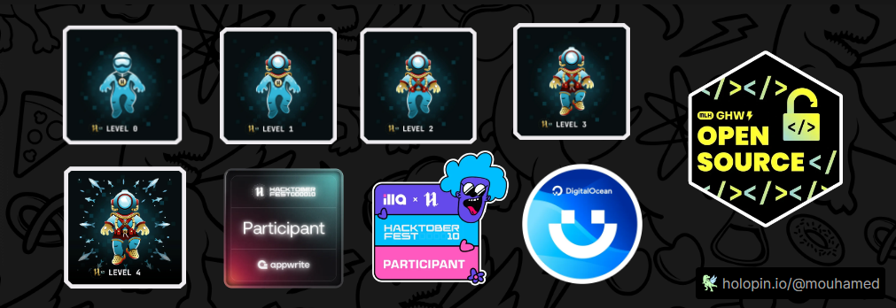

# 💫 About Me:
< Hello world ! /> 👋🏽   I am Mouhamed El Malick Hanne, a React developer passionate about the world of computing and technology. I have dedicated my time to exploring the endless possibilities offered by the world of web development, and I have acquired solid expertise in creating interactive and dynamic web applications💡.  🌍  I'm based in DAKAR, Senegal.  - 💻 Front-end development with Javascript, TypeScript, React, Next - 🔧 Create exceptional user experiences - 📁 Version management with Git and GitHub - 💡 Solve technical problems creatively  Contact me 📧 Email : [Mouhamedhanne72@gmail.com](mailto:mouhamedhanne72@gmail.com) 🌐 Portfolio : [https://mouhamedhanne.vercel.app](https://mouhamedhanne.vercel.app/) 📲 LinkedIn : [linkedin.com/mouhamed-el-malick-hanne](https://www.linkedin.com/in/mouhamed-el-malick-hanne-99199a2a6/) 

## 🌐 Socials:
   

# 💻 Tech Stack:
                            
# 📊 GitHub Stats:
 
 

### 🔝 Top Contributed Repo

---

### Badges earned during Hacktoberfest 2023.

---

<!-- Proudly created with GPRM ( https://gprm.itsvg.in ) -->
